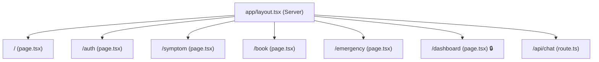

# 🏗️ AROGYA — ARCHITECTURE

---

## Project Tree

```
YY-51/
├── app/
│   ├── layout.tsx              ← Root layout (Server Component)
│   ├── page.tsx                ← / (Home)
│   ├── globals.css             ← Base styles + Tailwind
│   ├── favicon.ico
│   ├── api/
│   │   └── chat/
│   │       └── route.ts        ← POST /api/chat
│   ├── auth/
│   │   └── page.tsx            ← /auth
│   ├── symptom/
│   │   └── page.tsx            ← /symptom
│   ├── book/
│   │   └── page.tsx            ← /book
│   ├── emergency/
│   │   └── page.tsx            ← /emergency
│   └── dashboard/
│       └── page.tsx            ← /dashboard (protected)
├── components/
│   ├── layout/
│   │   ├── Navbar.tsx
│   │   └── Footer.tsx
│   ├── ui/
│   │   ├── GlassCard.tsx
│   │   ├── SOSButton.tsx
│   │   └── LanguageSwitcher.tsx
│   └── features/
│       ├── EmergencyMap.tsx
│       └── ParticleCanvas.tsx
├── lib/
│   ├── supabase/
│   │   ├── client.ts           ← createBrowserClient
│   │   └── server.ts           ← createServerClient
│   ├── hooks/
│   │   └── useUser.ts          ← Auth state hook
│   └── i18n/
│       ├── context.tsx          ← LanguageProvider + useLanguage
│       └── translations.ts     ← en/hi/te translation map
├── proxy.ts                     ← Request proxy (auth routing)
├── tailwind.config.ts           ← Design system tokens
├── next.config.ts               ← Image patterns
├── package.json
└── tsconfig.json
```

---

## Route Hierarchy



### Proxy-Level Auth Routing (`proxy.ts`)
- Unauthenticated + `/dashboard` → redirect to `/auth`
- Authenticated + `/auth` → redirect to `/dashboard`

---

## Component Hierarchy

```
RootLayout (Server)
├── LanguageProvider (Client) ← wraps all children
│   ├── ParticleCanvas (Client) ← fixed background
│   ├── Navbar (Client)
│   │   └── LanguageSwitcher (Client)
│   ├── <main> ← page content renders here
│   ├── Footer (Client)
│   └── SOSButton (Client) ← fixed FAB
```

### Per-Page Component Usage

| Page       | Components Used |
|------------|-----------------|
| `/`        | GlassCard, Counter (local), Framer Motion |
| `/auth`    | Framer Motion, Supabase client |
| `/symptom` | GlassCard, Framer Motion, Lucide icons |
| `/book`    | GlassCard, Framer Motion, Supabase client, useSearchParams |
| `/emergency` | GlassCard, EmergencyMap (dynamic, ssr:false), Framer Motion |
| `/dashboard` | GlassCard, Framer Motion, Supabase client |

---

## Data Flow Between Modules

```
┌─────────────┐    POST /api/chat     ┌──────────────────┐
│  /symptom   │ ───────────────────→  │  Anthropic API   │
│  (form)     │ ←─────────────────── │  (Claude Haiku)   │
└─────┬───────┘    JSON response     └──────────────────┘
      │
      │ action: "book"
      │ ?specialty=DoctorType
      ▼
┌─────────────┐    Supabase INSERT    ┌──────────────────┐
│  /book      │ ───────────────────→  │  appointments    │
│  (doctors)  │                       │  table           │
└─────────────┘                       └────────┬─────────┘
                                               │
┌─────────────┐    Supabase SELECT             │
│  /dashboard │ ←──────────────────────────────┘
│  (protected)│
└─────────────┘

┌─────────────┐    tel:108             ┌──────────────────┐
│  /emergency │ ───────────────────→  │  Phone dialer    │
│  (SOS)      │                       │  (native)        │
└─────────────┘                       └──────────────────┘
```

---

## Server vs Client Components

| File | Type | Reason |
|------|------|--------|
| `app/layout.tsx` | **Server** | No hooks, wraps LanguageProvider |
| `app/page.tsx` | Client | Uses `useRef`, `useEffect`, `useState` |
| `app/auth/page.tsx` | Client | Uses `useState`, `useRouter`, Supabase |
| `app/symptom/page.tsx` | Client | Uses `useState`, `fetch` |
| `app/book/page.tsx` | Client | Uses `useState`, `useSearchParams`, Supabase |
| `app/emergency/page.tsx` | Client | Uses `useState`, dynamic import |
| `app/dashboard/page.tsx` | Client | Uses `useState`, `useEffect`, Supabase |
| `app/api/chat/route.ts` | Server (Route Handler) | No React, runs on server |
| `proxy.ts` | Edge | Runs in Edge Runtime |
| `components/ui/GlassCard.tsx` | **Server** | No hooks, no "use client" |
| All other components | Client | Use hooks or browser APIs |
